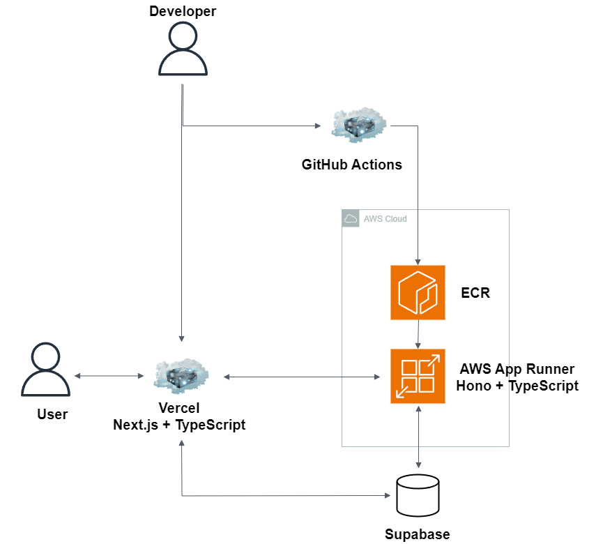

# 遠征Webアプリケーション概要(Backend側)

## Summary

TODO

## Tech

### Backend

-   TypeScript
-   Hono
-   AWS
    -   AWS App Runner
    -   ECR
-   Supabase
-   eslint
-   prettier
-   GitHub Actions

### 参考(Frontend)

-   TypeScript
-   Next.js
-   Hono
-   Supabase
-   vercel
-   jest
-   Playwright
-   eslint
-   prettier
-   GitHub Actions

## Architecture

## Frontend

リポジトリは以下となります。

-   [バックエンド](https://github.com/kojikawazu/nextjs-hono-front-travel-app)

## URL

-   [Hono](https://hono.dev/)

-   [TypeScript](https://www.typescriptlang.org/)

-   [Supabase](https://supabase.com/)

-   [AWS](https://aws.amazon.com/jp/console/)
